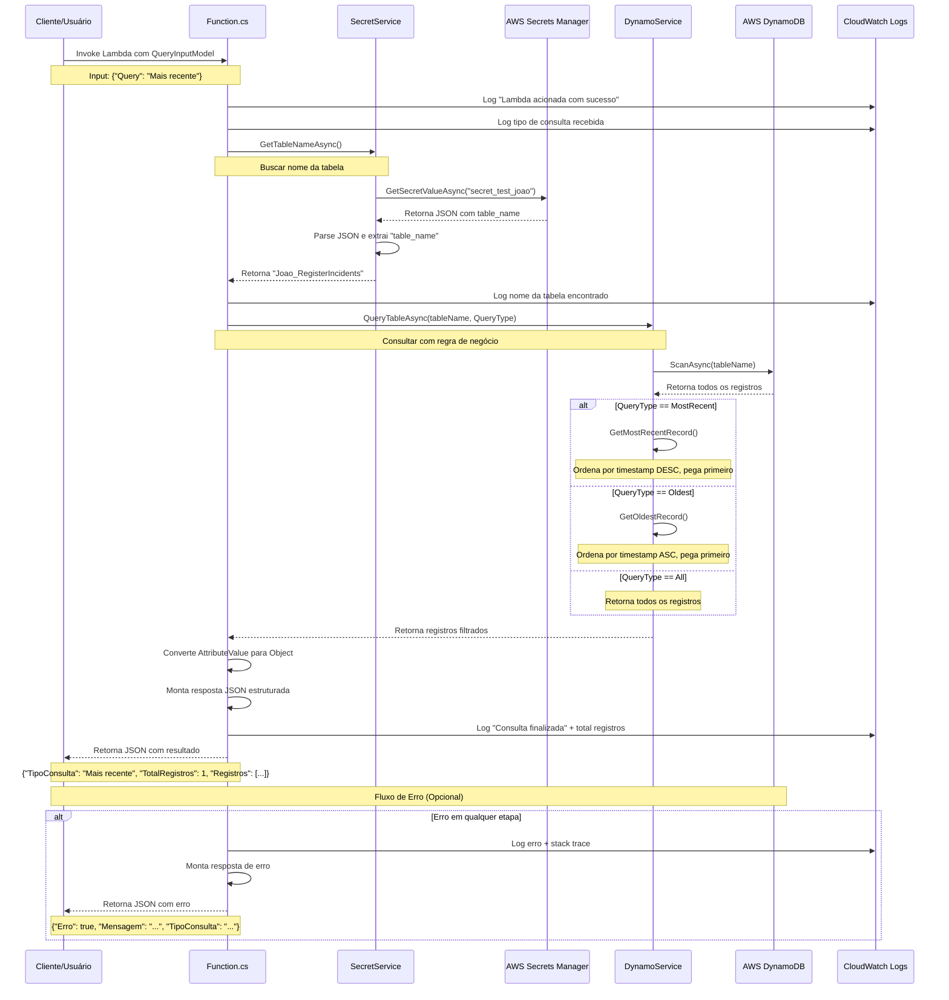

# Diagrama Sequencial - Lambda de Consultas DynamoDB

## Descrição do Fluxo

1. **Entrada**: Cliente invoca a lambda com o modelo de entrada contendo o tipo de consulta
2. **Logging**: Lambda registra o início da execução e o tipo de consulta
3. **Secret Manager**: SecretService busca o nome da tabela no AWS Secrets Manager
4. **DynamoDB**: DynamoService consulta a tabela e aplica as regras de negócio:
   - **Mais recente**: Ordena por timestamp decrescente, retorna o primeiro
   - **Mais antigo**: Ordena por timestamp crescente, retorna o primeiro  
   - **Todos**: Retorna todos os registros
5. **Processamento**: Lambda converte os dados e monta a resposta estruturada
6. **Resposta**: Retorna JSON formatado com os resultados ou erro

## Componentes Envolvidos

- **Function.cs**: Orquestrador principal
- **SecretService**: Gerencia acesso ao Secrets Manager
- **DynamoService**: Gerencia consultas ao DynamoDB
- **QueryInputModel**: Modelo de entrada com validação
- **AWS Services**: Secrets Manager e DynamoDB
- **CloudWatch Logs**: Logging detalhado